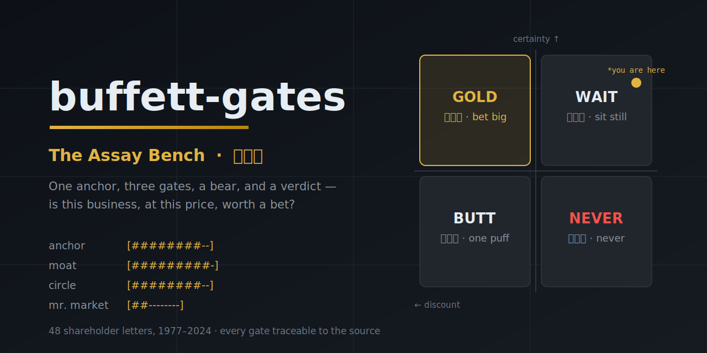

<p align="center">
  
</p>

# buffett-gates

**An assay bench, not a screener.** Wherever a candidate comes from — your own idea, a screener, a broker note — put it on the bench and test one thing only: **is this business, at this price, within my circle of competence, worth a bet? And after betting, is the bet still right?**

It does not hunt for ideas and it does not write 60-page research. Input: a listed company. Output: a verdict, the reasons, and the conditions under which you should run.

**[English](#how-it-works) · [中文说明](#中文说明)**

---

## How it works

Two stages, one interface:

```
INVEST stage (produces a snapshot)                     HOLD stage (quarterly review)
  │                                                      │
  ▼                                                      ▼
┌─────────┐  ┌─────────┐  ┌──────────────┐  ┌────────┐  ┌───────────────────────┐
│ Domain   │─▶│ First    │─▶│ Three gates   │─▶│ Bear    │─▶│ Quarterly review       │
│ check    │  │ look     │  │ anchor(+rev.) │  │ cuts,   │  │ Δfacts / Δprice / Δme  │
│ listed?  │  │ machine  │  │ moat · circle │  │ 3 ways  │  │ → quadrant trajectory  │
│ quoted?  │  │ or       │  │ · mr. market  │  │ to die  │  │ → exit-signal check    │
└─────────┘  │ mispriced?│  │ → 4 quadrants │  └────────┘  └───────────────────────┘
  out→reject  └─────────┘  │ → snapshot    │   bear runs only        no change
               neither→stop └──────────────┘   when money moves      = good news
```

- **Domain check** — listed companies only: an active quote plus mandatory disclosure. No quote, no Mr. Market, no verdict.
- **First look** — two admission questions: does it look like a machine that prints cash, or does the price look insane? Neither → the report ends in one paragraph. Rejection is also a verdict.
- **Three gates**, each traceable to a specific shareholder-letter year:
  - **Anchor** (1986/2000) — can Aesop's three questions be answered? Includes a **reverse check**: what growth does the current price imply, and is that assumption absurd?
  - **Moat gate** (2007) — will the moat be wider or narrower in ten years, and *why*? Industries that must rebuild their moat continuously are out, at any price.
  - **Circle & margin gate** (1996/1992) — is the judgment inside the circle of competence, and is the discount deep enough?
  - **Mr. Market gate** (1987) — is today's quote euphoric or depressed? Would you buy more after a 50% drop you couldn't sell into for five years?
- **The bear** (2012 — Buffett publicly recruited a *credentialed bear* to question him at his own annual meeting) — whenever the reading points to spending money, an independent sub-agent argues **only against**: it cuts every gate reading and names three observable ways the investment dies. A gap of ≥3 ticks on any gate forces a re-judgment.
- **Four quadrants** — certainty × discount. **The cell dictates the action**: bet big / sit still / one puff / never. No fence-sitting allowed.
- **Quarterly review** — reads the last snapshot, reports displacement on three layers (the facts, the price, *your own judgment* — the layer people hide), redraws the trajectory, checks exit signals. It is a check-up, not a trial: *no change is good news.*

## Why this isn't another checklist

1. **Traceable** — every gate stands on a specific letter (1986 owner earnings / 1987 Mr. Market / 2007 moat trilogy / 1989 cigar-butt demotion / 2012 credentialed bear), not paraphrased quotes.
2. **A generator, not a list** — the anchor-and-three-gates frame is rank-reduced from the full 1977–2024 letters. Checklists answer prepared questions; generators answer new ones.
3. **Forced verdicts** — binary admission, no fence-sitting at any gate, the quadrant dictates the action, and the quadrant must agree with the recommendation — structure forces the conclusion, principles don't have to beg.
4. **A built-in bear** — LLM analysis fails most often by talking itself into a story. Adversarial pressure is part of the pipeline, not luck.
5. **A closed loop** — snapshots leave gauge readings and an exit-signal table; the quarterly review diffs against them. Judgments are also logged publicly in [TRACK-RECORD.md](TRACK-RECORD.md), where time can falsify them.

## Case-law wiki (local)

The rank-reduction is the *statute*; a Karpathy-style LLM-maintained wiki over the letters corpus is the *case law* — how Buffett actually judged See's, GEICO, US Air, Dexter, PetroChina… Gate readings cite precedents for calibration; the bear cites them to cut. Schema and workflow are public in [wiki/SCHEMA.md](wiki/SCHEMA.md); the wiki body quotes the letters heavily and therefore stays local (copyright), same as the corpus. Rebuild both locally:

```
python scripts/fetch_letters.py     # 48 letters, 1977–2024
```

## Quick start

```
# INVEST stage
对 <name/ticker> 过闸 / 验成色 / run buffett-gates

# HOLD stage (needs a snapshot containing the two PROTOCOL blocks)
对 <name> 跑季检 / quarterly review
```

Install: copy (or symlink) `skills/buffett-gates/` into `~/.claude/skills/` and trigger from Claude Code.

## Repository layout

```
skills/buffett-gates/     the skill: INVEST (domain → first look → gates → bear → quadrant → snapshot)
                          + HOLD (quarterly review); references/ holds the rank-reduction
                          and 11 concept cards, each with sourced quotations
PROTOCOL.md               the only interface between the two stages: gauge record + exit-signal table
TRACK-RECORD.md           public verdict ledger — every run adds a row; time is the referee
ROADMAP.md                progress and to-dos
wiki/SCHEMA.md            structure & workflow of the local case-law wiki
scripts/fetch_letters.py  build the letters corpus locally (corpus not committed)
examples/                 full runs: snapshot · out-of-domain · veto · self-calibration · external snapshot
```

## Data quality

Precision depends on the runtime, and the report says so honestly: quotes come from live quote APIs (search engines index yesterday's news, not today's price); financials go to exchange filings first; whatever cannot be verified is flagged as a gap — never silently filled from stale training knowledge. See the hard rules in [SKILL.md](skills/buffett-gates/SKILL.md).

## License

MIT. Personal research tooling; nothing here is investment advice.

---

# 中文说明

**验金台。** 标的从哪来不管——你自己选的、筛选工具出的、券商研报推的——放上来，只验一件事：**这个价格、以我的认知，配不配下注；下注之后，赌注对不对。**

不筛选（那是投研流水线的活）、不做全流程研究、只验上市公司。输入永远是"已被某人选中的标的"，输出永远是"配不配 + 凭什么 + 什么情况该跑"。

## 为什么不是又一份 checklist

1. **可溯源**：每道闸背后站着具体年份的股东信原文（1986 owner earnings / 1987 市场先生 / 2007 护城河三分法 / 1989 烟蒂降级 / 2012 credentialed bear），非名言级转述
2. **生成器而非清单**：一锚三闸是从伯克希尔股东信 1977–2024 全量原文降秩出的最小生成器，不是清单的重新排列组合；清单答有准备的题，生成器答没见过的题
3. **强制结论**：法眼二选一、三闸不许骑墙、格子决定动作、格子结论必须与建议一致——靠结构逼，不靠原则劝
4. **有反方**：读数指向掏钱时，强制跑一个独立的 credentialed bear 子 Agent（2012 信，巴菲特给自家股东会公开招聘做空者提问）——只砍不建，逐闸砍价 + 给出三种死法；正反读数夹角 ≥3 格的闸重判。单线叙事越写越顺是 LLM 分析的头号失效模式，对抗是流程的一部分，不是运气
5. **季检闭环**：快照留下四闸读数 + 退出信号表；持有阶段每季重读仪表，对事实/价格/认知三层报告位移与归因，画四象限轨迹——是体检，不是审判。每次判决同时落入公开账本 [TRACK-RECORD.md](TRACK-RECORD.md)，对错交给时间

## 工作时间线

```
投资阶段                                                      持有阶段，每季度（季检）
  │                                                            │
  ▼                                                            ▼
┌──────┐  ┌──────┐  ┌────────────────┐  ┌──────────┐   ┌─────────────────────┐
│ 域检  │─▶│ 法眼  │─▶│ 三闸读数        │─▶│ 反方      │   │ 季检                 │
│ 上市? │  │ 好生意 │  │ 锚(含逆向校验)   │  │ 只砍不建  │─▶│ 三层位移与归因        │
│ 报价? │  │ or    │  │ ·竞争·认知·情绪  │  │ 三种死法  │   │ Δ事实/Δ价格/Δ认知    │
└──────┘  │ 好错价 │  └────────────────┘  │ → 四象限  │   │ → 四象限轨迹         │
  域外→出局 └──────┘   指向掏钱才跑反方 ──▶  │ → 快照    │   └─────────────────────┘
            两相皆无→停笔                  └──────────┘        无变化 = 好消息
```

## 判例库（本地 Wiki）

降秩全文（rank.md）是**法条**，语料 Wiki 是**判例**——巴菲特怎么判喜诗、GEICO、美国航空、Dexter、中石油。三闸读数引判例定刻度，反方拿判例砍价。结构与工作流公开在 [wiki/SCHEMA.md](wiki/SCHEMA.md)；wiki 正文大量引用原文，与语料一样只留本地（版权）。本地重建一条命令：`python scripts/fetch_letters.py`。

## 快速开始

```
# 投资阶段
对 <标的名/代码> 过闸 / 验成色 / 跑 buffett-gates

# 持有阶段（季检）
对 <标的> 跑季检（需已有一份含仪表读数的快照）
```

安装：将 `skills/buffett-gates/` 目录复制（或软链）到 `~/.claude/skills/` 即可在 Claude Code 中触发。

## 仓库结构

```
skills/buffett-gates/   唯一 skill：投资阶段（域检 → 法眼 → 三闸 → 反方 → 四象限 → 快照）+ 持有阶段（季检）
  └── references/       一锚三闸降秩全文 + 11 张概念卡（每张含原文引文）
PROTOCOL.md             投资阶段与持有阶段之间的接口规范：仪表读数记录 + 退出信号表
TRACK-RECORD.md         公开判决账本：每次投资阶段/季检落一行，判决对错交给时间检验
ROADMAP.md              项目进展与待办
wiki/SCHEMA.md          语料 Wiki（判例库）的结构与工作流；wiki 正文含原文引用不入库
scripts/fetch_letters.py  一条命令自建 48 封股东信语料库（语料不入库）
examples/               快照（泡泡玛特）· 域检出局（华为）· 法眼停笔（立昂技术）·
                        自校准（苹果，对表巴菲特本人动作）· 外来快照接入（Tempus AI）·
                        季检示例（待 7-25 宁德时代中报后补）
```

## 数据质量说明

数据链的实际精度取决于运行环境，不是玄学：

- 本机装有 akshare 且可调用时，财务数据能拿到结构化一手数据，精度最高
- 仅靠通用网络工具（WebFetch/WebSearch）时：行情类数据（股价、市值）走行情接口/页面直接抓取当前价，不用搜索——搜索引擎索引的是历史资讯，天然搜不到"今天"的价格；财务类数据优先找官方公告的 HTML 摘要版，PDF 附件解析失败率不低，遇到解析失败会换二级来源交叉核对并如实说明，不假装拿到了实际没拿到的精度
- 报告的信息丰富度分级（数据链硬规则第 6 条）就是把这种精度差异如实暴露出来——拿不到的数据，报告里写清楚缺口在哪，不用旧数据或训练知识里的数字顶替

## License

MIT。个人研究工具，一切输出均非投资建议。
